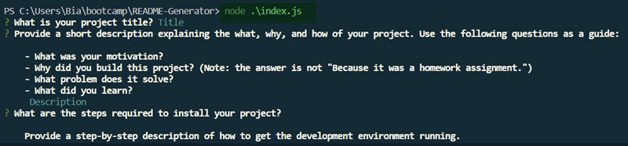
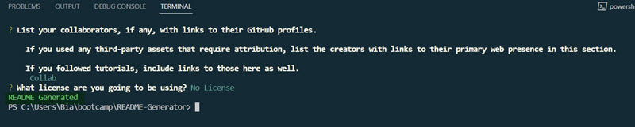

# README Generator

## Description

The README Generator is js program that is run via node to generate a README file after receiving answers from the user about what they want in the file.

## Table of Contents

- [Installation](#installation)
- [Usage](#usage)
- [Credits](#credits)

## Installation

To install the things necessary to run this program, you will need to do an:

    npm install

This should install all the packages necessary for this script to run.

## Usage

To run this script you will need to go to your terminal and run:

    node index.js

This script will ask a series of questions about what you would like to include in the README file. Once all the questions are answered you should get a notice in the terminal saying:

    README Generated

From there make sure the README file is in the dist folder. Copy it into the project you need this for and then update as needed.

## Credits

ReadMe Guide: https://coding-boot-camp.github.io/full-stack/github/professional-readme-guide  
License Information: https://choosealicense.com/  
Badge Information: https://gist.github.com/lukas-h/2a5d00690736b4c3a7ba  
ReadMe formatting: https://docs.github.com/en/get-started/writing-on-github/getting-started-with-writing-and-formatting-on-github/basic-writing-and-formatting-syntax  
Tutoring help (Erik Hirsch)  